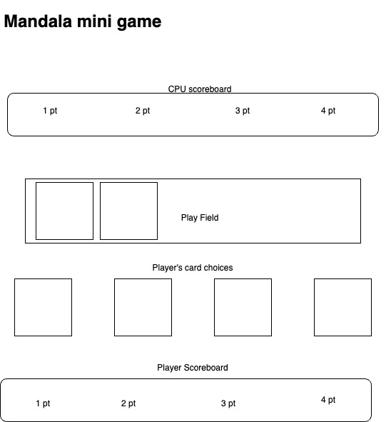

# __Mini-Mandala__

Color coded card game of art, skill and chance.

## __Game Outline__

The goal of mini-mandala is to get the high score. The player and the CPU work together to create a "mandala' in the center of the screen by placing various colored cards in the play field in turn order. The player may chose between four cards, the cards will be random and either red, green, blue, and yellow (duplicates are possible). Play continues until all four colors have been played, then the field is cleared.

To clear the field, the last player to place a card choses a color and takes the corresponding cards. then the subsequent player choses a color until all four colors have been chosen.

Scoring will be counted by the amount of each of the color cards the players have, compared to the values on their individual scoreboard. The order of the colors determines the value of that color for that player. The first color taken by the player will represent the "1 pt" value, the second color card represents the "2 pt" value, the third "3 pt", and the fourth "4 pt".

When either player has acquiered a fourth color on their scoreboard, the endgame is triggered. then all the cards each player has is tallied and a winner is declared.

## __Page Design__

## __MVP goals__

1. Create a function to pick a random color (red, blue, green, yellow). This function will be used to "deal" cards to the player and the CPU.

2. Create a function to control CPU moves. After player moves, CPU produces a random color to the board.
    1. the CPU will also need a function for chosing colors during the clear the field phaze.

3. Create a function for controling the scoring.
    1. Set the color to the corresponding point value.
    2. Create an object to contain player "cards" for scoring at the end.
    3. Create a function for counting score.
    4. Determine winner.

4. Create function for player moves.
    1. Click for selecting card to play.
    2. Click for selecting color when clearing the play field.
    3. Create a function to draw player's hand back up to four cards.

5. Design gameboard.
    1. Scoreboard for CPU.
    2. Scoreboard for Player.
    3. Field for playing cards.
    4. Area for player's cards.
    5. Display for final score.

6. Formulate the end game.

7. (mini-stretch goal) Create/find cards that represent better artistic design than just colored squares.

## __Stretch Goals__

1. Add two more colors to gameplay.
    1. Add colors (purple, orange).
    2. Add point structures for 5 pt, and 6 pt.

2. Create three seperate play fields. 
    1. Create play field for CPU (CPU only).
    2. Create community play field (CPU, Player).
    3. Create play field for player (Player only).

3. Make CPU decision tree intelligent instead of random.

4. Drag and drop the players cards to the play field.

## __Challenges__

1. The overall complexity of the game seems like it will be difficult to organize and design all the logic.

2. Scoring is going to be a big challenge.

## __Tech Stack__

1. Styling with CSS flexbox or grid

2. javaScript

3. (stretch goal) Explore other syling options

## Inspiration:

Mandala is already a card game built for two players. It is a great game and vastly more complicated than anything described above. Below is a link to find the game online, as well as a decription by the original game makers:

[Mandala](https://lookout-spiele.de/en/games/mandala.html)

The Mandala: the symbol of an ancient and sacred ritual. Colored sand is laid to create a symbolic map of the world, before the pattern is ceremonially destroyed and the sand cast into the river an ever repeating cycle of life, death, and rebirth.

With a slow and steady movement from your wrist, you cautiously pour the last remaining sand onto the edge of the Mandala. After standing up you look at your masterpiece, being satisfied with its looks. Black sand was a good choice as the color stands for death and renewal and that is exactly what is going to happen next. The ceremonial destruction of the Mandala represents the renunciation from the physical world as well as the rebirth. Like the next Mandala which is already starting to form in your head, ready to flow through your hands into a new and beautiful artwork.

Mandala from Trevor Benjamin & Brett J. Gilbert is not quite as spiritual. This tactical 2 player game lets players from 10 and up compete in the creation of Mandalas. In about 30 minutes several Mandalas are created and destroyed and the players try to earn as many victory points in this process as possible by collecting the different colors their abstract Mandalas are made of. Who will earn the most points? Who will be the master of Mandalas?

You start the game with a hand of six cards and the central playing mat, displaying two Mandalas and a River and Cup for each player. The Mandalas are separated into three areas, the Mountain area in the middle and the two player areas on their respective sides. On your turn you can choose from three actions: Either you play exactly one card into the Mountain area of one of the Mandalas and draw up to three new cards, or you play any amount of cards of exactly one color in your personal player area. Using one of these two actions, you have to follow the Rule of Color! This rule states, that in a Mandala each color may only be found in exactly one area. In other words: if red is already located in the Mountain area, you can not play red cards into your player area (but you could play a red card into the Mountain area). As a third action you can choose to not play any card into a Mandala at all, but instead put any number of cards of the same color onto the discard pile and draw exactly the same amount of cards you discarded. After you finished your turn, you check if a Mandala has been finished. This means: all six colors of the game are represented in that Mandala. If thats the case, the ceremony of destruction happens. Beginning with the player who has more cards in their player area, that player choose one color from the Mountain area, takes all cards of that color and adds them to their River and Cup. The position of the color in your River determines how much victory points the cards of the same color in your Cup are worth for you at the end of the game. The game ends either when the draw pile is used up or one player has all six colors of the game added to their River.

## __To Do__

- [X] Write basic HTML page.
- [X] Write necessary CSS page.
- [X] Write a list of variables to start with.
- [ ] Write a list of eventListeners to identify click events.
    - [X] Click event for player turn selection.
    - [ ] Click event for player field selection.
    - [ ] Click event to clear the board and start a new game.
- [X] Write a function (colorPicker) to choose a random color.
- [ ] Write a function (CPUMove) to place a random card for the CPU.
- [ ] Write a funtion (CPUChoice) to make the CPU choose the highest value color from the field.
- [ ] Write a function (tallyScore) that tallies the totals of each color for each player.
- [ ] Write a function (colorScore) that collects the order of the colors taken by each player and applies the correct value
- [ ] Write a function (calcScore) that calculates the total score based on total cards per color vs. value for each color.
- [ ] Improve stylesheet and overall aesthetics of the game.